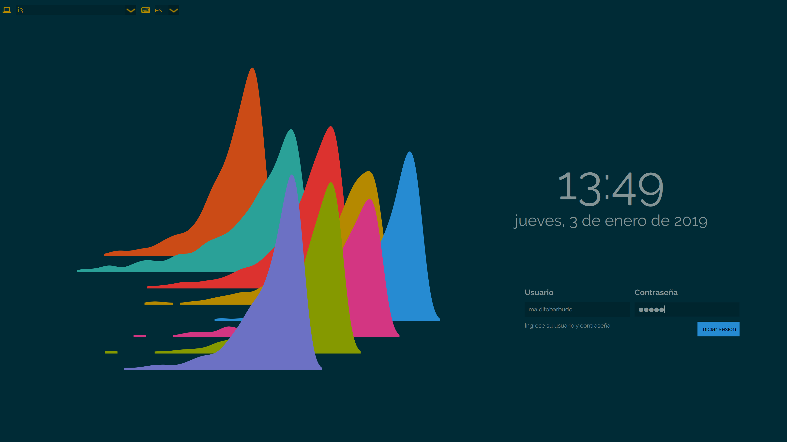

# Solarized theme for sddm

This theme is inspired by Numix sddm theme
([https://github.com/intialonso/intialonso.github.io](https://github.com/intialonso/intialonso.github.io/tree/master/themes/sddm/numix))
by Inti Alonso and the default sddm theme, maui ([https://github.com/sddm/sddm](https://github.com/sddm/sddm)).
Wallpaper was created using [inkscape](https://inkscape.org).
It also uses some icons from Numix icon theme
[https://github.com/numixproject/numix-icon-theme](https://github.com/numixproject/numix-icon-theme)
(shutdown, warning and down arrow icons).  
QML files contain license headers.  

## Aim
The aim of this theme is to display a simple yet complete sddm greeter based in
solarized palette by Ethan Schoonover
([http://ethanschoonover.com/solarized](http://ethanschoonover.com/solarized)).  
I use this colors almost everywhere so, why not in the greeter? ;)

## Dependencies
This theme relies in `Fontawesome` font. If you try this, make sure that it is
installed in your system. In archlinux this font can be installed from aur:  

- [ttf-font-awesome](https://aur.archlinux.org/packages/ttf-font-awesome)  

## Installation

### Stable version

#### Archlinux

Theme can be installed from `solarized-sddm-theme`
[aur package](https://aur.archlinux.org/packages/solarized-sddm-theme/). This
package contains the latest stable version.

#### Other linux distributions

  > This theme has only been tested in archlinux. Theme should work in other
    distributions like fedora or ubuntu, though, but use it at your own risk.

For installing in other linux distributions you must get the latest stable version
from [github](https://github.com/MalditoBarbudo/solarized_sddm_theme/releases)
(`0.1.8` at the moment of writing):

```
# this command will download and untar the package
wget --no-check-certificate https://github.com/MalditoBarbudo/solarized_sddm_theme/archive/0.1.6.tar.gz -O - | tar xz
```

and copy the created theme folder to `/usr/share/sddm/themes`.
Finally, don't forget to change the theme in `/etc/sddm.conf`.

## Fonts

This theme uses by default `Raleway` font. If `Raleway` is not installed
default sddm font is used. `Raleway` can be installed on arch from aur:

- [otf-raleway](https://aur.archlinux.org/packages/otf-raleway/)  
- `Raleway` also can be installed from
  [ttf-google-fonts-git](https://aur.archlinux.org/packages/ttf-google-fonts-git/)
  which also installs other cool fonts.

#### Changing font in `theme.conf`:
If you want to try different fonts, or just use the
one you love, or simply setting one really installed in your system you can
modify the displayFont field in the`theme.conf` file (in the theme folder,
usually in `/usr/share/sddm/themes/solarized-sddm-theme/` if installed from aur)
with your exclusive font selection. For example, to change to Montserrat font:

```
[General]
background=background.png
displayFont="Montserrat"
```

But be careful, some fonts really don't mix well with the theme.

## Screenshot (2019-01-03)



## Former backgrounds

With version 0.1.8 a new default background was introduced (`ridges`). If you
prefer the former backgrounds (`bars`, `circles` or `traces`) you can find them
in the theme folder as `bars_background.png`, `circles_background.png` and
`traces_background.png`.
To use any of them change the `theme.conf` file accordingly:

```
[General]
background=bars_background.png
```
or

```
[General]
background=circles_background.png
```

## Known Issues

1. Multimonitor issues. In some multimonitor configurations it may appear some
   glitches in the theme. Working on it.

## License

Theme is licensed under GPL.  
QML files are MIT licensed.
